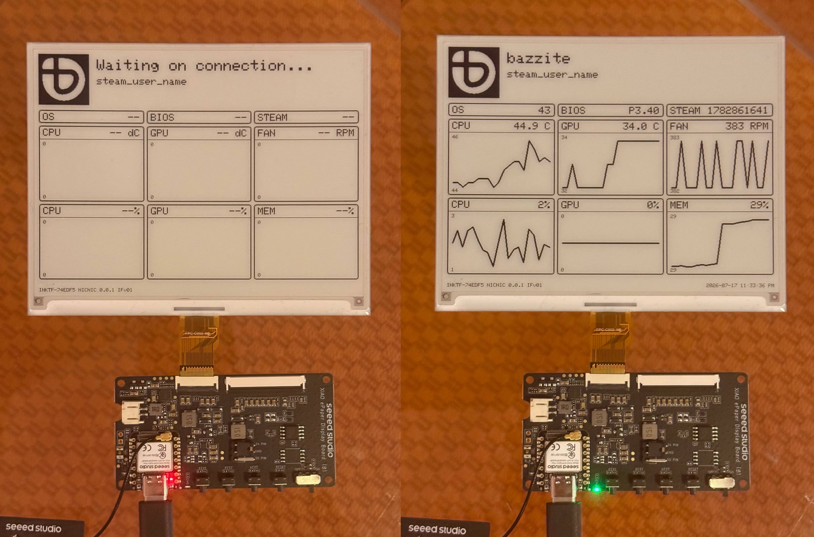
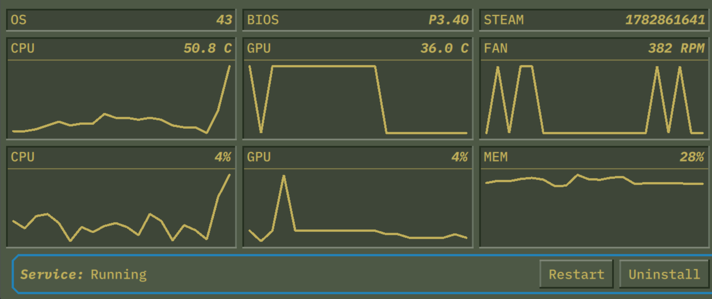

# reinkterface
Fork of [Valve's Inkterface](https://gitlab.steamos.cloud/SteamHardware/SteamMachine/inkterface/) for non Steam Machine usage with simpler hardware



## In more words
I wanted to have Valve's inkterface in my custom built PC running Bazzite.
In this version there is no soldering required and no battery needed.
This will only run on Linux based machines (tested on Bazzite).

Note: This is just the firmware, you still have to build the official Valve's app that will connect to the board and send data to it.

Changes to the code:
- Rewritten to use `GxEPD2` library with built in support for `GxEPD2_583_GDEQ0583T31` panel
- Completely removed battery logic as the board will be wired to the motherboard's USB port internally.
- Increased height of the stat tiles from 100 to 150px.
- Swapped the logo in the top left corner to Bazzite.

## Hardware needed
- Board - [XIAO ePaper Display Board(ESP32-S3) - EE04](https://www.seeedstudio.com/XIAO-ePaper-Display-Board-EE04-p-6560.html)
- E-Ink Panel - [Waveshare 5.83" e-ink display 648x480px](https://www.waveshare.com/5.83inch-e-paper.htm)

## Building and uploading firmware
- Install PlatformIO for your system
- Connect the display ribbon cable to the board
- Connect the board to a computer via USB cable

```
pio run -t upload
```

When it comes to building the Interface (the app that sends the data via BT), follow the instructions on [Valve's GitLab repo](https://gitlab.steamos.cloud/SteamHardware/SteamMachine/inkterface). This fork is fully compatible with that.

## Logo
You can change the Bazzite logo to whatever you want that is 100x100px.

How I did it:
- Got the BW Bazzite logo from their [Press Kit](https://github.com/ublue-os/bazzite/tree/main/press_kit)
- Removed the "d-pad" for clarity on small display using [Boxy SVG app](https://boxy-svg.com)
- Converted it to bitmap using [image2cpp](https://javl.github.io/image2cpp/)

## Fan RPM
By default, the Inkterface app from Valve won't report Fan RPM - this is to be expected, the app is reading fan rpm from a custom hardware monitor `steamdeck` which does not exist on normal Linux installs.
I found a way around this by poking in the app's code but this will vary based on your setup.
Ultimately it was a one line change in [sysstats.hpp](https://gitlab.steamos.cloud/SteamHardware/SteamMachine/inkterface/-/blob/main/include/sysstats.hpp?ref_type=heads):

```cpp
double getFanRPM() { return readHwmonNode("steamdeck_hwmon", "fan1_input"); }
```

You will need to find your fan in `/sys/class/hwmon`.
In my particular case I need `fan2_input` from `hwmon5` - the name of the hw monitor can be read from file called `name` inside of each `hwmon` directory - in my case it's `nct6792` therefore I changed this line like so:

```cpp
double getFanRPM() { return readHwmonNode("nct6792", "fan2_input"); }
```

After that I rebuilt the app and it started reporting Fan RPM and sending it to the screen.



## Disclaimer
I have used LLM to speed up the process of rewriting the code and adjusted it afterwards.